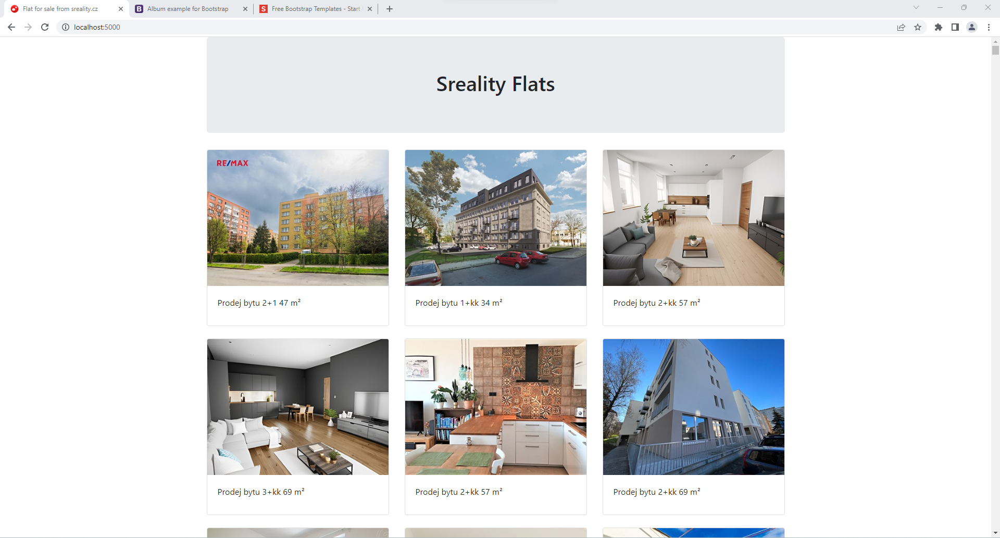

# Display images of the flats scraped from [Sreality](https://sreality.cz/)

## Results

- Scrapped flats: [http://127.0.0.1:8080/](http://127.0.0.1:8080/)
- Captured Image
  

## Run
  ```shell
    docker-compose up
  ```
